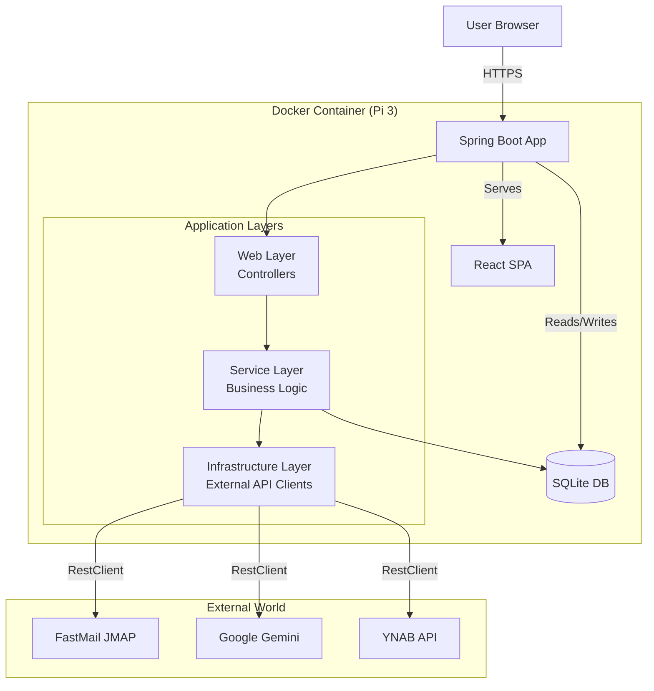

# Project Plan: YNAB Amazon Automator

**Version:** 1.0.0  
**Status:** Draft  
**Target Hardware:** Raspberry Pi 3 (or equivalent low-resource environment)  
**Stack:** Kotlin, Spring Boot 3, React, SQLite, Flyway, Docker  

---

## 1. Overview

### Elevator Pitch
Automate YNAB transaction categorization by parsing Amazon order confirmation emails. The system extracts order information, classifies the order based on user-supplied category descriptions using AI, and updates YNAB transactions accordingly.

### Core Constraints
- **Hardware:** Must run on Raspberry Pi 3 (ARMv7/ARM64, limited RAM).
- **Memory:** JVM heap limited to 512MB.
- **Architecture:** Layered Architecture (Controller -> Service -> Infrastructure). No Hexagonal ports/adapters.
- **Database:** SQLite with Flyway migrations.
- **Tenancy:** Single tenant v1, structured for multi-tenancy v2 (no global static state).
- **Security:** API keys stored in DB (plaintext v1), UI not exposed to internet.
- **Error Handling:** Failed email parses are discarded/logged. Pending transactions remain indefinitely until matched.

---

## 2. Architecture

### Component Diagram



### Project Structure

```text
src/main/kotlin/com/ynabauto
├── Application.kt
├── config
│   ├── SchedulerConfig.kt      // @EnableScheduling
│   ├── WebConfig.kt            // SPA Fallback mapping
│   └── RestClientConfig.kt     // Global RestClient customization
├── web
│   ├── ConfigController.kt     // API Keys & Category Config
│   ├── OrderController.kt      // Pending Orders View
│   ├── LogController.kt        // Sync Logs View
│   └── dto                     // Request/Response objects
├── service
│   ├── EmailIngestionService.kt// Polls Email, parses, saves Orders
│   ├── YnabSyncService.kt      // Polls YNAB, matches Transactions
│   ├── ClassificationService.kt// Orchestrates AI calls
│   ├── ConfigService.kt        // Manages App Config (Keys, Rules)
│   └── MatchingStrategy.kt     // Logic to match Order <-> Transaction
├── domain
│   ├── Order.kt                // JPA Entity
│   ├── SyncLog.kt              // JPA Entity
│   ├── CategoryRule.kt         // JPA Entity
│   └── AppConfig.kt            // JPA Entity (Key/Value)
├── infrastructure
│   ├── email
│   │   ├── EmailProviderClient.kt // Interface
│   │   └── FastMailJmapClient.kt  // Implementation (v1)
│   ├── ai
│   │   ├── ClassificationProvider.kt // Interface
│   │   └── GeminiProvider.kt   // Implementation (v1)
│   ├── ynab
│   │   ├── YnabClient.kt       // Interface
│   │   └── YnabRestClient.kt   // Implementation (v1)
│   └── persistence
│       └── Repositories.kt     // Spring Data JPA Interfaces
└── resources
    ├── static                  // Built React App
    └── db
        └── migration           // Flyway SQL scripts
```

---

## 3. Data Model (SQLite)

Managed via **Flyway**. All tables designed to allow future `tenant_id` addition.

### `app_config`
Stores runtime configuration and API keys.
| Column | Type | Notes |
| :--- | :--- | :--- |
| `key` | VARCHAR | PK (e.g., `YNAB_TOKEN`, `FASTMAIL_USER`) |
| `value` | TEXT | |
| `updated_at` | TIMESTAMP | |

### `category_rules`
Stores YNAB categories and user-supplied AI hints.
| Column | Type | Notes |
| :--- | :--- | :--- |
| `id` | INTEGER | PK |
| `ynab_category_id` | VARCHAR | |
| `ynab_category_name` | VARCHAR | |
| `user_description` | TEXT | Keywords/description for AI |
| `updated_at` | TIMESTAMP | |

### `amazon_orders`
Parsed email data waiting for transaction match.
| Column | Type | Notes |
| :--- | :--- | :--- |
| `id` | INTEGER | PK |
| `email_message_id` | VARCHAR | Unique |
| `order_date` | TIMESTAMP | |
| `total_amount` | DECIMAL | |
| `items_json` | TEXT | Array of item names |
| `status` | VARCHAR | `PENDING`, `MATCHED`, `COMPLETED`, `DISCARDED` |
| `ynab_transaction_id` | VARCHAR | Nullable |
| `ynab_category_id` | VARCHAR | Nullable |
| `created_at` | TIMESTAMP | |

### `sync_logs`
Audit trail for UI.
| Column | Type | Notes |
| :--- | :--- | :--- |
| `id` | INTEGER | PK |
| `source` | VARCHAR | `EMAIL`, `YNAB` |
| `last_run` | TIMESTAMP | |
| `status` | VARCHAR | `SUCCESS`, `FAIL` |
| `message` | TEXT | Error details |

---

## 4. External API Specifications

### A. Email Provider (FastMail via JMAP)
**Interface:** `infrastructure.email.EmailProviderClient`  
**Client:** Spring `RestClient`  
**Required JMAP Methods:**
1.  `Mailbox/get`: Retrieve Inbox ID.
2.  `Email/query`: Search messages (`from` amazon.com, `subject` Order Confirmation, `receivedAt` > last_sync).
3.  `Email/get`: Fetch headers (Date, Message-ID).
4.  `EmailBody/get`: Fetch plain text/html body for parsing.

### B. YNAB API
**Interface:** `infrastructure.ynab.YnabClient`  
**Client:** Spring `RestClient`  
**Required Endpoints:**
1.  `GET /budgets/{budget_id}/transactions`: Fetch recent transactions for matching.
2.  `GET /budgets/{budget_id}/categories`: Populate frontend configuration.
3.  `PUT /budgets/{budget_id}/transactions/{transaction_id}`: Update `memo` and `category_id`.

### C. AI Classification (Google Gemini)
**Interface:** `infrastructure.ai.ClassificationProvider`  
**Client:** Spring `RestClient`  
**Required Endpoint:**
1.  `POST /generateContent`: Send item list + category rules, receive selected category.

---

## 5. Frontend Requirements

The React app will be served statically by Spring. It requires 4 specific views:

1.  **Configuration (API Keys)**
    *   Inputs: YNAB Token, FastMail User, FastMail Pass/Token, Budget ID, Gemini Key.
    *   Endpoint: `GET/PUT /api/config/keys`.
2.  **Category Descriptions**
    *   View: List of YNAB categories (fetched via backend proxy).
    *   Action: Text area next to each category for user-supplied AI hints.
    *   Endpoint: `GET /api/ynab/categories`, `PUT /api/config/categories`.
3.  **Pending Orders**
    *   View: Table of orders parsed from email not yet matched to YNAB.
    *   Endpoint: `GET /api/orders/pending`.
4.  **System Logs**
    *   View: List of sync attempts (Email/YNAB) with status/time.
    *   Endpoint: `GET /api/logs`.

---

## 6. Core Logic Flows

### Email Ingestion (`@Scheduled`)
1.  Load `FASTMAIL` creds from `app_config`.
2.  Call `EmailProviderClient.searchOrders(sinceDate)`.
3.  Parse Body (Amount, Date, Items).
    *   *Fail:* Log warning, skip.
    *   *Success:* Insert `amazon_orders` (Status: `PENDING`).
4.  Update `sync_logs` (Source: `EMAIL`).

### YNAB Sync & Match (`@Scheduled`)
1.  Load `YNAB` creds from `app_config`.
2.  Fetch `amazon_orders` where `status = 'PENDING'`.
3.  Fetch YNAB Transactions (recent).
4.  **Match:** Compare Amount/Date. If match -> Update `amazon_orders` (Status: `MATCHED`, set `ynab_transaction_id`).
5.  **Classify:** For `MATCHED` orders without category:
    *   Load `category_rules`.
    *   Call `ClassificationProvider`.
    *   Update `amazon_orders` with `category_id`.
    *   Call `YnabClient.updateTransaction`.
    *   Update `amazon_orders` (Status: `COMPLETED`).
6.  Update `sync_logs` (Source: `YNAB`).

---

## 7. Implementation Plan

### Phase 1: Foundation
- [ ] Initialize Spring Boot + Kotlin + Flyway + SQLite.
- [ ] Configure `application.properties` for SQLite and Flyway.
- [ ] Create `V1__init.sql` with table schemas.
- [ ] Create JPA Entities and Repositories.

### Phase 2: Infrastructure Clients
- [ ] Implement `RestClientConfig`.
- [ ] Implement `YnabRestClient` (Interface + Impl).
- [ ] Implement `FastMailJmapClient` (Interface + Impl).
- [ ] Implement `GeminiProvider` (Interface + Impl).

### Phase 3: Backend Logic
- [ ] Implement `ConfigService` (DB backed config).
- [ ] Implement `EmailIngestionService` (Scheduler + Parse logic).
- [ ] Implement `YnabSyncService` (Scheduler + Match logic).
- [ ] Implement `ClassificationService`.
- [ ] Create REST Controllers for Frontend features.

### Phase 4: Frontend
- [ ] Initialize React App.
- [ ] Build Configuration View (Keys).
- [ ] Build Category Rules View.
- [ ] Build Pending Orders View.
- [ ] Build Logs View.
- [ ] Configure Spring to serve static React build.

### Phase 5: Devops
- [ ] Setup e2e test to test the full workflow. (Use a wiremock server to mock external APIs)
- [ ] Setup GitHub Actions for CI/CD. Run tests automatically on any push

### Phase 6: Deployment
- [ ] Create Multi-stage Dockerfile (Node build -> Gradle build -> JRE run).
- [ ] Test locally (x86) and on Target (ARM).
- [ ] Setup automatic github release when merged to the prod branch

### Phase 7: Scope Creep
- [ ] TBD

---

## 8. Deployment & Resource Constraints

### Dockerfile Strategy
Multi-stage build to keep final image small.
1.  **Stage 1 (Node):** Build React app.
2.  **Stage 2 (Gradle):** Build Kotlin Jar, copy React build to `src/main/resources/static`.
3.  **Stage 3 (JRE):** Alpine Linux, copy Jar, set ENV.

### JVM Tuning (Pi 3)
Critical to prevent OOM kills.
```dockerfile
ENV JAVA_TOOL_OPTIONS="-Xmx512m -XX:+UseSerialGC -XX:MaxMetaspaceSize=128m"
```

### Database Persistence
Mount a volume to preserve SQLite data across container updates.
```bash
docker run -v /opt/ynab-auto/data:/app/data ...
```
*Note: Configure Spring `spring.datasource.url` to point to `/app/data/database.sqlite`.*

### Multi-Tenancy Future Proofing
- **No Static State:** All config read from DB per execution.
- **Schema:** Tables designed to accept `tenant_id` column later without logic refactors.
- **Auth:** v1 has no auth (UI not exposed). v2 will add auth middleware that sets tenant context.

---

## 9. Risks & Mitigations

| Risk | Mitigation |
| :--- | :--- |
| **Pi 3 Memory OOM** | Strict JVM heap limits (`-Xmx512m`), Serial GC, limit DB connection pool to 5. |
| **JMAP Complexity** | Use Spring `RestClient` for raw JSON over JMAP instead of heavy libraries. |
| **AI Cost/Latency** | Only classify when match is found. Cache category rules. |
| **YNAB Rate Limits** | Schedule syncs no faster than 5 minutes. Batch updates if possible (v1 uses single updates). |
| **Email Parsing Failures** | Catch exceptions in ingestion loop, log to `sync_logs`, continue processing next email. |
